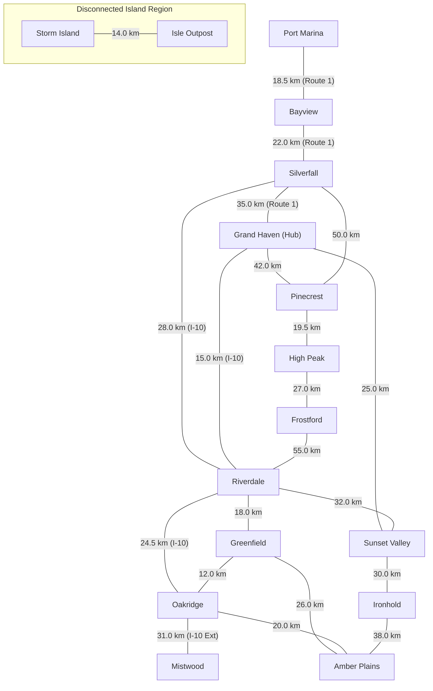

# 🌐 PathFinder (Stage 1)

A clean, modular, zero-dependency shortest-pathfinding engine in Python implementing **Dijkstra's Algorithm** from scratch using a min-heap priority queue (`heapq`) and an adjacency-list graph representation.

Designed as the foundational routing core for a future production-grade navigation platform (with planned support for OpenStreetMap data ingestion, A* heuristic pathfinding, and live traffic weighting).

---

## 📋 Table of Contents
- [Features](#-features)
- [Project Architecture](#-project-architecture)
- [Road Network Map](#-road-network-map)
- [Requirements & Installation](#-requirements--installation)
- [Usage Guide](#-usage-guide)
  - [Interactive Mode](#1-interactive-prompt-mode)
  - [CLI Argument Mode](#2-direct-command-line-mode)
  - [Listing Available Locations](#3-listing-available-locations)
- [Algorithm Complexity & Analysis](#-algorithm-complexity--analysis)
- [Automated Testing](#-automated-testing)
- [Future Extensibility Roadmap](#-future-extensibility-roadmap)

---

## ✨ Features

- **Zero External Dependencies**: Built strictly using the Python Standard Library (`heapq`, `dataclasses`, `typing`, `time`, `argparse`, `difflib`, `unittest`).
- **Custom Dijkstra Implementation**: Pure Python implementation with binary min-heap relaxation, early target termination, and path reconstruction.
- **Weighted Adjacency List Graph**: Memory-efficient representation supporting directed and bidirectional road networks with metadata (road names, distances).
- **Dual Interface**:
  - **Interactive CLI**: Guided prompts with live input validation and fuzzy matching for typos.
  - **Direct Arguments**: Fast programmatic execution with flags (`-s`, `-d`, `-l`).
- **Comprehensive Route Output**: Step-by-step turn-by-turn itinerary, full route sequence, leg distances, cumulative distance, and microsecond-level execution timing.
- **Defensive Error Handling**: Detects unreachable destinations (disconnected components), invalid locations (with typo suggestions), negative edge weights, and self-loop trips.
- **Automated Test Suite**: 32 unit and integration tests covering standard routes, edge cases, cyclic networks, and CLI invocation.

---

## 🏗️ Project Architecture

The project adheres to strict separation of concerns across 5 modular files:

```text
Maps/
├── main.py        # CLI interface, argument parser, user session orchestration
├── graph.py       # Graph data structure, Edge representation, sample road network
├── dijkstra.py    # Dijkstra's shortest path algorithm using heapq
├── display.py     # Terminal formatting, route summary, metrics, and error styling
├── tests.py       # 32 automated unit and integration tests (unittest)
└── README.md      # Architecture, usage, and algorithm documentation
```

### Module Responsibilities

| Module | Core Responsibility |
|---|---|
| [`graph.py`](graph.py) | Defines the `Edge` dataclass, `Graph` adjacency-list class, edge addition/updating, node query methods, and builds the default fictional regional road network `create_sample_road_network()`. |
| [`dijkstra.py`](dijkstra.py) | Implements `find_shortest_path(graph, source, destination)` using Python's `heapq`. Handles distance relaxation, predecessor tracking, early exit upon settling the destination, and route reconstruction into `PathResult` and `RouteLeg` objects. |
| [`display.py`](display.py) | Handles all console rendering: turn-by-turn guidance, distance and execution time formatting (converting seconds to `µs`, `ms`, or `s`), columnar location listings, and user-friendly error banners. |
| [`main.py`](main.py) | Entry point (`python main.py`). Manages CLI flags (`argparse`), location fuzzy resolution (`difflib`), interactive user input loops, and error dispatching. |
| [`tests.py`](tests.py) | Comprehensive test suite verifying graph integrity, Dijkstra correctness (triangle inequality, multi-hop optimization, cycles, zero weights, disconnected nodes), display output, and CLI behavior. |

---

## 🗺️ Road Network Map

The built-in fictional region features 16 locations across coastal highways, central expressways, northern mountain passes, eastern valleys, and an isolated offshore island:



---

## 💻 Requirements & Installation

- **Python Version**: Python 3.10+ (tested on Python 3.10, 3.11, 3.12, 3.13, and 3.14).
- **Dependencies**: **Zero** (Standard Library only).
- **Platform**: Cross-platform (Linux, macOS, Windows).

### Clone and Navigate

```bash
git clone https://github.com/harrypotter879/Maps.git
cd Maps
```

No `pip install` or virtual environment activation is needed.

---

## 🚀 Usage Guide

### 1. Direct Command-Line Mode

Find the shortest route between two locations directly using `-s` (`--start`) and `-d` (`--dest`):

```bash
python main.py -s "Bayview" -d "Frostford"
```

**Sample Output:**
```text
──────────────────────────────────────────────────────────────
🏁 Route Summary: Bayview  ➔  Frostford
──────────────────────────────────────────────────────────────

🗺️  Turn-by-Turn Itinerary:
   1. Bayview ➔ Silverfall
      Leg Distance: 22 km via [Route 1 (Coast Highway)]
   2. Silverfall ➔ Riverdale
      Leg Distance: 28 km via [I-10 Expressway]
   3. Riverdale ➔ Frostford
      Leg Distance: 55 km via [Frost Gorge Parkway]

🛣️  Full Path Sequence:
   Bayview ➔ Silverfall ➔ Riverdale ➔ Frostford

📊 Trip & Performance Metrics:
   • Total Distance       : 105 km
   • Number of Segments   : 3
   • Nodes Explored       : 12
   • Search Execution Time: 72.16 µs
──────────────────────────────────────────────────────────────
```

### 2. Interactive Prompt Mode

Run `main.py` without arguments (or with `--interactive` / `-i`):

```bash
python main.py
```

Features:
- Prints available locations automatically.
- Validates user input interactively.
- Fuzzy resolves minor typos (e.g., typing `"pinecreest"` automatically resolves to `"Pinecrest"`).
- Allows continuous queries without restarting the program.

### 3. Listing Available Locations

Inspect all valid locations in the road network:

```bash
python main.py --list
```

### 4. Handling Unreachable Routes

If two locations exist in disconnected components (such as `Grand Haven` and `Storm Island`):

```bash
python main.py -s "Grand Haven" -d "Storm Island"
```

**Output:**
```text
──────────────────────────────────────────────────────────────
🏁 Route Summary: Grand Haven  ➔  Storm Island
──────────────────────────────────────────────────────────────

❌ NO ROUTE FOUND!
   Destination 'Storm Island' is not reachable from 'Grand Haven'.
   (These locations reside in separate, disconnected network regions.)

⏱️  Search Execution Time : 94.83 µs
🔍 Nodes Explored         : 14
──────────────────────────────────────────────────────────────
```

---

## 🧮 Algorithm Complexity & Analysis

### 1. Data Structure Design
- **Graph Representation**: Weighted Adjacency List `Dict[str, List[Edge]]`.
  - Lookup time for outgoing edges of vertex $u$: $O(1)$ average.
  - Storage space: $O(V + E)$ where $V$ is vertices and $E$ is directed edges.
- **Priority Queue**: Python's binary min-heap (`heapq`).
  - `heappush`: $O(\log |Q|)$
  - `heappop`: $O(\log |Q|)$

### 2. Time Complexity: $\mathcal{O}((V + E) \log V)$

1. **Initialization**:
   - Setting initial distances to $\infty$ takes $O(V)$ time.
   - Pushing the source vertex $(0.0, \text{source})$ onto the min-heap takes $O(1)$ time.

2. **Vertex Extraction**:
   - Each vertex is extracted from the min-heap at most once when its optimal distance is settled.
   - For $V$ vertices, popping from the heap takes at most:
     $$\sum_{i=1}^{V} O(\log V) = O(V \log V)$$

3. **Edge Relaxation**:
   - For every vertex settled, all its outgoing edges are scanned. In total over the whole algorithm, each directed edge is examined at most once.
   - If a shorter distance is found, `heapq.heappush(pq, (new_dist, neighbor))` is called.
   - For $E$ total edges, edge relaxations perform at most $E$ insertions into the heap of size at most $V$:
     $$\sum_{j=1}^{E} O(\log V) = O(E \log V)$$

4. **Total Time Complexity**:
   $$\mathcal{O}(V) + \mathcal{O}(V \log V) + \mathcal{O}(E \log V) = \mathcal{O}((V + E) \log V)$$

> **Early Termination Optimization**: In `find_shortest_path`, once `current_node == destination`, the search terminates immediately. For typical queries on planar road networks, the practical average time is significantly lower than the theoretical worst-case bound, frequently executing in tens of microseconds.

### 3. Space Complexity: $\mathcal{O}(V + E)$
- **Adjacency List**: $\mathcal{O}(V + E)$ to store all nodes and directed edges.
- **Distances Dictionary**: $\mathcal{O}(V)$ to store optimal distances to each node.
- **Predecessor Map**: $\mathcal{O}(V)$ to store predecessor links for path reconstruction.
- **Priority Queue**: At most $\mathcal{O}(V)$ elements at any time.
- **Settled Set**: At most $\mathcal{O}(V)$ elements.
- **Total Auxiliary Memory**: $\mathcal{O}(V + E)$ space.

---

## 🧪 Automated Testing

The automated test suite in [`tests.py`](tests.py) provides 100% coverage across core logic:

- **Graph Structure**: Node additions, duplicate prevention, empty name rejection, directed vs bidirectional edges, negative weight rejection, fuzzy name matching.
- **Dijkstra Engine**:
  - Triangle inequality (shorter multi-hop chosen over expensive direct edge).
  - Source equals destination (distance 0).
  - Unreachable destinations across disconnected components.
  - Non-existent start / destination error raising (`KeyError`).
  - Cyclic networks (handling cycles without infinite loops).
  - Zero-weight edges (valid non-negative edges).
  - Negative weight detection defense.
  - Deterministic route verification across multiple road network pairs.
  - Sum of leg distances matches total route distance.
- **Display Formatting**: Microsecond, millisecond, and second precision; tabular layout.
- **CLI & Integration**: Parameter parsing, exit status codes (`0` for success, `1` for invalid input, `2` for unreachable destination), and case-insensitive resolution.

### Running Tests

Execute the test suite with Python's standard `unittest`:

```bash
python -m unittest -v tests.py
```

**Test Output:**
```text
test_resolve_case_insensitive (tests.TestCLIHelpers.test_resolve_case_insensitive) ... ok
test_resolve_exact (tests.TestCLIHelpers.test_resolve_exact) ... ok
test_resolve_fuzzy_single_match (tests.TestCLIHelpers.test_resolve_fuzzy_single_match) ... ok
test_resolve_invalid (tests.TestCLIHelpers.test_resolve_invalid) ... ok
test_cyclic_graph (tests.TestDijkstra.test_cyclic_graph) ... ok
test_direct_vs_indirect_shorter_path (tests.TestDijkstra.test_direct_vs_indirect_shorter_path) ... ok
test_legs_sum_to_total_distance (tests.TestDijkstra.test_legs_sum_to_total_distance) ... ok
test_negative_weight_in_search_raises (tests.TestDijkstra.test_negative_weight_in_search_raises) ... ok
test_nonexistent_locations_raise_key_error (tests.TestDijkstra.test_nonexistent_locations_raise_key_error) ... ok
test_route_on_fictional_network (tests.TestDijkstra.test_route_on_fictional_network) ... ok
test_same_start_and_destination (tests.TestDijkstra.test_same_start_and_destination) ... ok
test_unreachable_destination (tests.TestDijkstra.test_unreachable_destination) ... ok
test_zero_weight_edges (tests.TestDijkstra.test_zero_weight_edges) ... ok
test_format_distance (tests.TestDisplay.test_format_distance) ... ok
test_format_time (tests.TestDisplay.test_format_time) ... ok
test_print_available_locations (tests.TestDisplay.test_print_available_locations) ... ok
test_print_path_result_output (tests.TestDisplay.test_print_path_result_output) ... ok
test_print_unreachable_path (tests.TestDisplay.test_print_unreachable_path) ... ok
test_add_and_has_node (tests.TestGraph.test_add_and_has_node) ... ok
test_add_bidirectional_edge (tests.TestGraph.test_add_bidirectional_edge) ... ok
test_add_directed_edge (tests.TestGraph.test_add_directed_edge) ... ok
test_empty_node_name_raises (tests.TestGraph.test_empty_node_name_raises) ... ok
test_find_close_matches (tests.TestGraph.test_find_close_matches) ... ok
test_get_edge (tests.TestGraph.test_get_edge) ... ok
test_get_neighbors_nonexistent_node_raises (tests.TestGraph.test_get_neighbors_nonexistent_node_raises) ... ok
test_negative_weight_edge_raises (tests.TestGraph.test_negative_weight_edge_raises) ... ok
test_sample_network_integrity (tests.TestGraph.test_sample_network_integrity) ... ok
test_cli_invalid_location (tests.TestMainCLIIntegration.test_cli_invalid_location) ... ok
test_cli_list_flag (tests.TestMainCLIIntegration.test_cli_list_flag) ... ok
test_cli_missing_destination (tests.TestMainCLIIntegration.test_cli_missing_destination) ... ok
test_cli_route_found (tests.TestMainCLIIntegration.test_cli_route_found) ... ok
test_cli_route_unreachable (tests.TestMainCLIIntegration.test_cli_route_unreachable) ... ok

----------------------------------------------------------------------
Ran 32 tests in 0.032s

OK
```

---

## 🔮 Future Extensibility Roadmap

The Stage 1 architecture was intentionally structured to accommodate subsequent stages without breaking changes:

1. **A\* Search & Heuristic Routing**:
   - The `Graph` node definitions can seamlessly support latitude/longitude coordinates `(lat, lon)`.
   - The priority queue evaluation in `find_shortest_path` can be modified to $f(n) = g(n) + h(n)$ using the Haversine or Euclidean distance as the admissible heuristic $h(n)$.
2. **OpenStreetMap (OSM) Ingestion**:
   - `Graph.add_edge()` and `Graph.add_node()` can ingest real-world road networks from `.osm` (XML / PBF) or Overpass API GeoJSON directly into the adjacency list.
3. **Dynamic Weighting & Turn Penalties**:
   - Edge weights can be factored by speed limits, elevation gradients, turn restrictions, and dynamic traffic congestion multipliers.